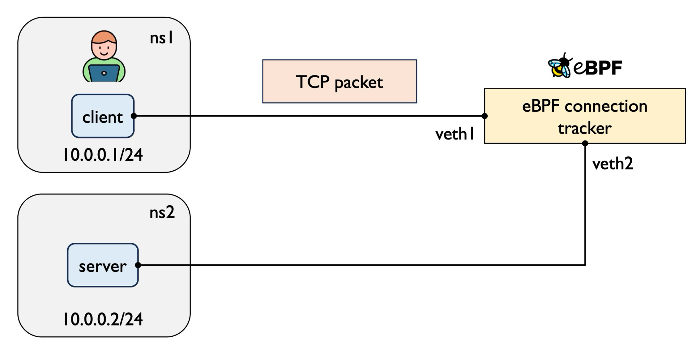
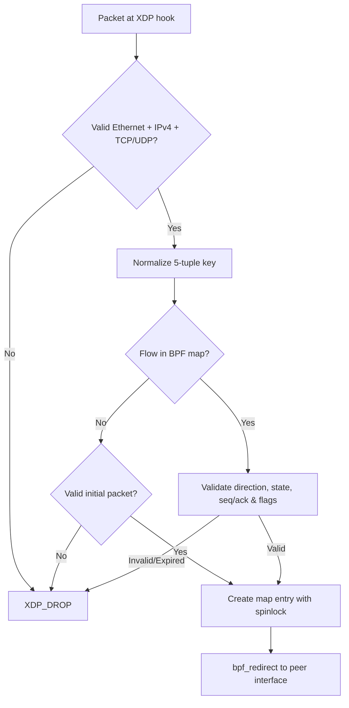
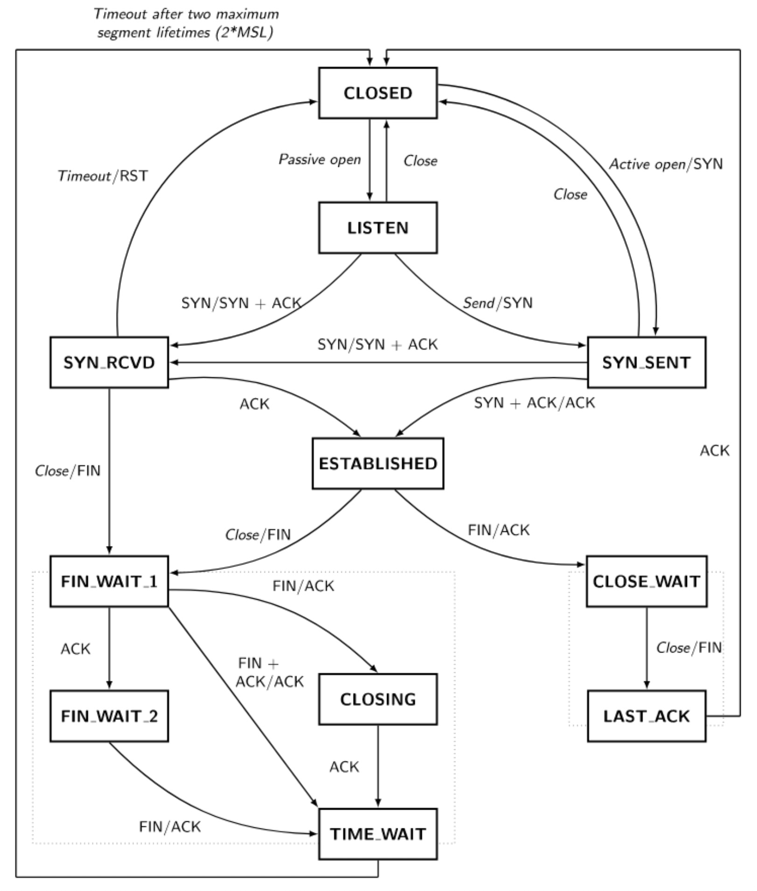
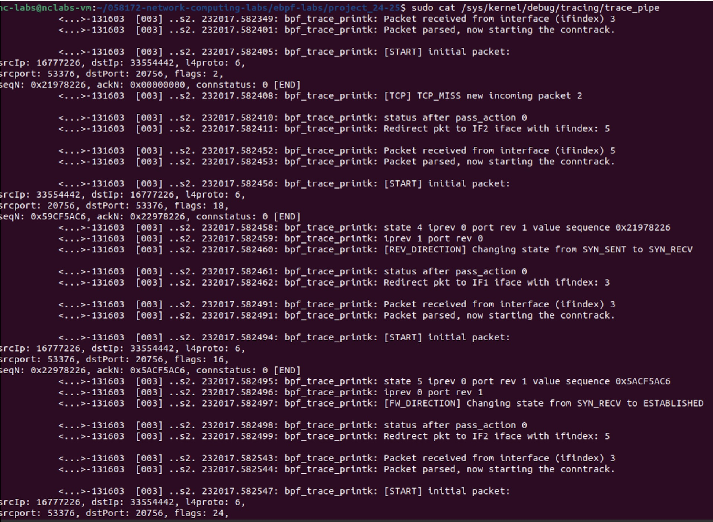

# eBPF TCP/UDP Connection Tracker

An in-kernel, stateful connection tracker implemented as an eBPF/XDP program. It parses IPv4 TCP and UDP traffic directly on the fast data path, normalizes bidirectional flows into BPF hash maps, validates state transitions, handles teardowns and timeouts, and redirects accepted packets between isolated Linux network namespaces.

**Repository:** [github.com/icgoogo/ebpf_tcp_tracker](https://github.com/icgoogo/ebpf_tcp_tracker?utm_source=gemini)

---

## Why This Project

Linux standard `conntrack` operates deeper within the kernel networking stack. Rebuilding a stateful connection tracker at the XDP (eXpress Data Path) layer allows exploring:

- Verifier-safe packet parsing with explicit bounds checks
- Bidirectional flow key normalization
- In-kernel TCP and UDP state machine tracking
- Concurrency-safe BPF map updates using `bpf_spin_lock`
- Fine-grained timeout, reset, and stale entry cleanup
- High-performance, line-rate packet forwarding using `bpf_redirect`

---

## Architecture & Topology


The lab topology uses two Linux network namespaces (`ns1` as client and `ns2` as server) connected through a pair of virtual Ethernet interfaces. The eBPF/XDP tracker attaches to the forwarding interfaces, inspecting traffic and managing connection state in shared BPF maps.

| Component          | Role / Purpose                                        |
| ------------------ | ----------------------------------------------------- |
| `ns1` / `10.0.0.1` | Client network namespace                              |
| `ns2` / `10.0.0.2` | Server network namespace                              |
| `veth1`, `veth2`   | Host-side interfaces attached to the XDP tracker      |
| `veth1_`, `veth2_` | Namespace-side virtual Ethernet interfaces            |
| `connections`      | Hash map storing up to 65,536 normalized active flows |
| `metadata`         | Per-CPU array map for packet and byte metrics         |

---

## Packet Processing Pipeline

Every incoming packet on the XDP hook traverses a multi-step validation and redirection flow:



### Processing Steps

1. **Header Parsing:** Validates Ethernet II framing, supports up to two VLAN headers, and parses IPv4 headers. Non-IPv4, ARP, and non-TCP/UDP traffic are dropped.
2. **Key Normalization:** Constructs a normalized 5-tuple flow key where IP addresses and ports are sorted deterministically so forward and reverse traffic resolve to the same map entry.
3. **Map Lookup & Validation:** Queries the `connections` BPF hash map.

- **Existing Flow:** Checks connection direction, state flags, sequence/acknowledgement numbers, and TTL.
- **New Flow:** Verifies whether the packet is a valid initiation (e.g., TCP SYN or initial UDP request).

4. **State Lock & Update:** Acquires a `bpf_spin_lock` on the map entry to atomically update state, expected sequences, and timeouts.
5. **Action Execution:** Redirects allowed packets to the peer interface (`XDP_REDIRECT`) or drops invalid, expired, or reset traffic (`XDP_DROP`).

---

## State Machine & Flow Tracking

### TCP State Machine

The tracker observes the full TCP lifecycle across both directions. A `CLOSED` connection is represented by the removal or absence of a map entry.


### UDP Flow Tracking

Since UDP is connectionless, the tracker models a lightweight flow lifecycle with per-entry TTL and hop limits:

| State             | Transition Trigger     | Description                                   |
| ----------------- | ---------------------- | --------------------------------------------- |
| `UDP_REQUEST`     | Outbound UDP packet    | Initial packet creates the flow entry         |
| `UDP_ESTABLISHED` | Reverse UDP response   | Reverse traffic observed; connection verified |
| `UDP_EXPIRED`     | Inactivity TTL timeout | Stale entry removed; must be re-established   |

---

## Teardown, Reset, and Expiration

- **TCP Handshake Strictness:** A SYN consumes one sequence number sequence space; reverse `SYN+ACK` must acknowledge `seq + 1`. The completing `ACK` is accepted only when the flow is in `SYN_RECV` with matching acknowledgement values.
- **Reset (RST) Handling:** Receiving an `RST` packet immediately deletes the matching entry from the BPF map and drops the packet.
- **TIME_WAIT Behavior:** `TIME_WAIT` entries carry a strict fixed expiration time so subsequent packets do not indefinitely refresh the flow lifetime.
- **Stale Entry Cleanup:** Expired entries return to the miss path, enabling new `SYN` or `UDP` packets to replace old connections cleanly.

---

## Implementation Details

### Normalized Map Key Structure

```c
struct ct_k {
    uint32_t srcIp;
    uint32_t dstIp;
    uint8_t  l4proto;
    uint16_t srcPort;
    uint16_t dstPort;
} __attribute__((packed));

```

Addresses and ports are ordered (smaller endpoint first) before key lookup to ensure symmetrical mapping across bidirectional traffic.

### User-Space Loader & Skeleton

The user-space binary relies on `libbpf` to:

1. Load compiled BPF bytecode into the kernel.
2. Attach the XDP program in native/driver mode to specified interfaces (`veth1`, `veth2`).
3. Poll per-CPU statistics maps and display real-time telemetry.
4. Clean up attachments gracefully on `SIGINT` or `SIGTERM`.

---

## Observability & Verification

State transitions and packet processing decisions can be monitored in real time through the kernel tracing pipe:

```bash
sudo cat /sys/kernel/debug/tracing/trace_pipe

```

### Handshake Execution Trace

The screenshot below demonstrates the complete three-way TCP handshake captured via `bpf_printk` during live execution:


#### Representative Log Sequence

```text
[START] initial packet: srcIp: 16777226, dstIp: 33554442, l4proto: 6, flags: 2 (SYN)
[TCP] TCP_MISS new incoming packet
...
[REV_DIRECTION] Changing state from SYN_SENT to SYN_RECV
Redirect pkt to IF1 iface with ifindex: 3
...
[FW_DIRECTION] Changing state from SYN_RECV to ESTABLISHED
Redirect pkt to IF2 iface with ifindex: 5

```

---

## Repository Layout

```text
.
├── conntrack.c                 # User-space loader and statistics loop
├── conntrack_if_helper.c       # Network interface helper functions
├── create-topo.sh              # Network namespace and veth topology generator
├── ebpf/
│   ├── conntrack.bpf.c         # Core XDP program and state transition logic
│   ├── conntrack_maps.h        # Flow table and metadata map definitions
│   ├── conntrack_parser.h      # Packet parser (Ethernet, VLAN, IPv4, TCP, UDP)
│   └── conntrack_structs.h     # Key, value, and TCP/UDP state structures
├── xdp_loader.c                # Auxiliary XDP pass-loader for namespace links
└── Makefile                    # Build scripts for BPF objects and binaries

```

---

## Build and Run Guide

1. **Clone and Compile:**

```bash
git clone https://github.com/icgoogo/ebpf_tcp_tracker.git
cd ebpf_tcp_tracker
make

```

2. **Setup Network Topology:**

```bash
sudo ./create-topo.sh

```

3. **Launch Connection Tracker:**

```bash
sudo ./conntrack --iface1 veth1 --iface2 veth2 --log_level 5

```

4. **Observe Handshake & Traffic:**
   Open a secondary terminal to inspect tracing logs:

```bash
sudo cat /sys/kernel/debug/tracing/trace_pipe

```

Generate test TCP traffic using `netcat` (`nc`):

```bash
# Terminal 1: Start Server inside ns2
sudo ip netns exec ns2 nc -l 8080

# Terminal 2: Connect from Client inside ns1
sudo ip netns exec ns1 nc 10.0.0.2 8080

```

---
