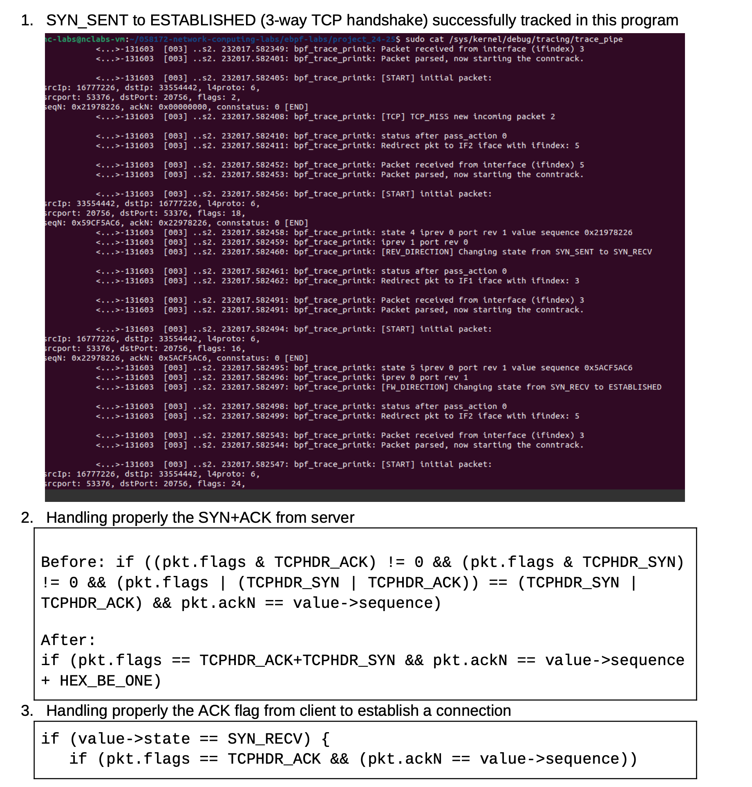
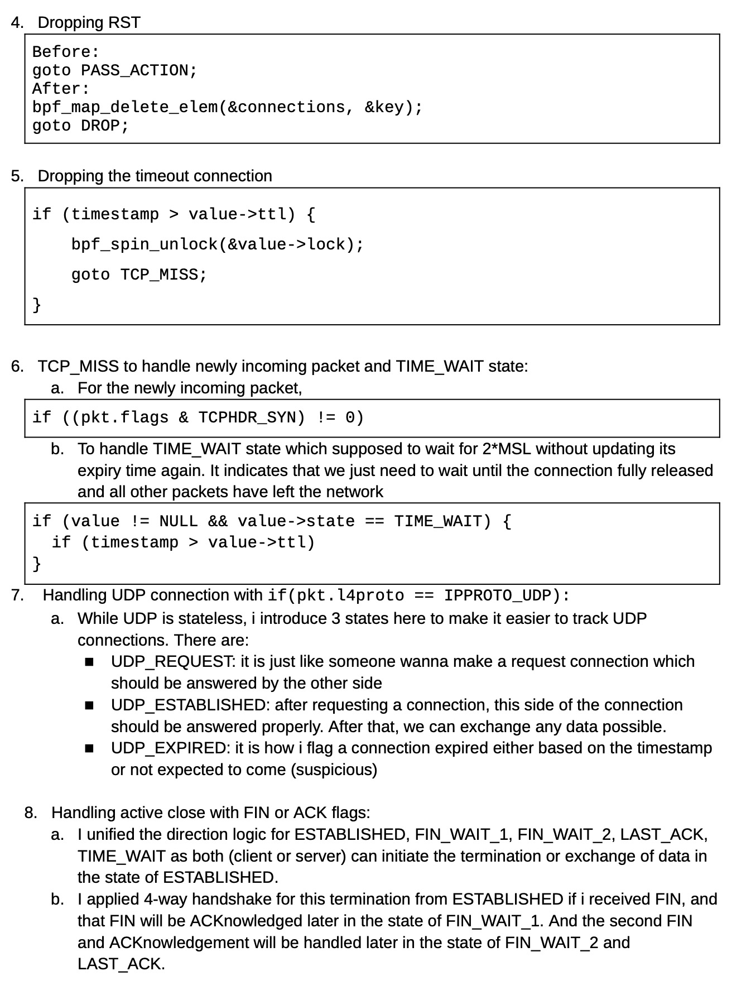

# eBPF TCP Connection Tracker

[](https://www.kernel.org/)
[](https://ebpf.io/)
[](https://en.wikipedia.org/wiki/C_(programming_language))

An in-kernel connection tracker built with eBPF to observe TCP flows, validate packet transitions, and maintain per-flow state as traffic moves between isolated Linux network namespaces.

This project explores how stateful packet processing can be implemented close to the Linux networking data path. It tracks the TCP three-way handshake, established connections, connection teardown, reset packets, and expired entries while forwarding packets between a client and a server.

> [View the source repository](https://example.com)

## Architecture

The test environment uses two Linux network namespaces connected through a pair of virtual Ethernet interfaces. The eBPF program inspects packets on the forwarding path and stores connection state in a BPF map.


| Component | Role |
| --- | --- |
| `ns1` | Client namespace at `10.0.0.1/24` |
| `ns2` | Server namespace at `10.0.0.2/24` |
| `veth1` and `veth2` | Virtual interfaces carrying traffic between the namespaces |
| eBPF connection tracker | Parses packets, looks up flow state, validates transitions, updates the map, and redirects or drops traffic |
| BPF connection map | Stores state and timeout information for each flow |

## What It Tracks

- TCP flow identity using source and destination addresses, ports, and transport protocol
- Forward and reverse traffic for the same connection
- The three-way handshake from `SYN_SENT` through `SYN_RECV` to `ESTABLISHED`
- Active and passive connection termination using `FIN` and `ACK`
- `TIME_WAIT` expiration without continuously extending its lifetime
- Reset handling by removing the matching map entry and dropping the RST packet
- Lightweight UDP flow tracking with request, established, and expired states
- Stale connection detection using per-entry time-to-live values

## TCP State Model

The tracker follows the standard TCP lifecycle and keeps both directions synchronized as packets traverse the eBPF hook.


The core path implemented and tested by the project is:

```text
CLOSED -> SYN_SENT -> SYN_RECV -> ESTABLISHED
       -> FIN_WAIT_1 -> FIN_WAIT_2 -> TIME_WAIT -> CLOSED

Peer-initiated close:
ESTABLISHED -> CLOSE_WAIT -> LAST_ACK -> CLOSED
```

## Packet Processing Flow

For every packet, the program:

1. Parses the network and transport headers.
2. Builds a flow key and determines the packet direction.
3. Looks up the connection in the BPF map.
4. Creates a new entry for an allowed initial packet or validates the transition of an existing entry.
5. Updates sequence, acknowledgement, state, and timeout data while holding the entry lock where required.
6. Redirects an accepted packet to the peer interface or drops an invalid, expired, or reset flow.

## Connection Establishment

The trace below shows the complete three-way handshake being recognized by the tracker. A client SYN creates the flow, the reverse SYN+ACK moves it to `SYN_RECV`, and the final ACK changes the state to `ESTABLISHED`.



Two correctness details are important:

- A SYN consumes one sequence number, so the SYN+ACK acknowledgement must match the original sequence number plus one.
- The final client ACK is accepted only for a flow already in `SYN_RECV` with the expected acknowledgement number.

## Teardown, Reset, and Expiration

Connection cleanup covers graceful termination, abrupt resets, and inactivity timeouts. `TIME_WAIT` is treated specially so later packets do not keep refreshing its expiration time.



When an RST packet is received, the tracker removes the connection from the map and drops the packet. When an entry has expired, the packet returns to the miss path, where a valid new SYN may create a fresh connection. The teardown path supports either endpoint initiating the close.

## Observability

During development, state transitions can be inspected through the kernel tracing pipe:

```bash
sudo cat /sys/kernel/debug/tracing/trace_pipe
```

Representative transitions include:

```text
[REV_DIRECTION] Changing state from SYN_SENT to SYN_RECV
[FW_DIRECTION]  Changing state from SYN_RECV to ESTABLISHED
```

These trace messages make it possible to correlate packet flags, sequence numbers, interface indices, and state changes while testing the program.

## Environment

The project is intended for a Linux environment with:

- A kernel with eBPF support
- Clang/LLVM for compiling the BPF program
- `libbpf` and kernel headers
- `iproute2` for network namespaces, virtual Ethernet devices, and program attachment
- `bpftool` for inspecting loaded programs and maps
- Root privileges or the Linux capabilities required to load and attach eBPF programs

## Running the Project

Clone the repository and follow its setup script or Makefile to create the namespaces, compile the program, and attach it to the virtual interfaces:

```bash
git clone https://example.com
cd ebpf-tcp-connection-tracker
```

Because eBPF attachment commands and interface indices depend on the host, check the repository's build and setup targets before running them. After attachment, generate TCP traffic between `10.0.0.1` and `10.0.0.2`, then watch `trace_pipe` to verify the state transitions.

## Key Takeaways

This project demonstrates practical experience with eBPF packet processing, Linux network namespaces, BPF maps, bidirectional flow normalization, concurrency-safe state updates, TCP sequence and acknowledgement validation, connection timeout handling, and kernel-level debugging.

## Future Improvements

- Replace development tracing with a ring buffer for structured user-space events
- Add automated tests for simultaneous close, retransmissions, out-of-order packets, and malformed headers
- Export connection metrics for visualization and performance analysis
- Add IPv6 support
- Benchmark throughput, latency, and map pressure under concurrent connections

## Project Link

Source code and implementation details: [https://example.com](https://example.com)

## License

Add the license used by the source repository here.
